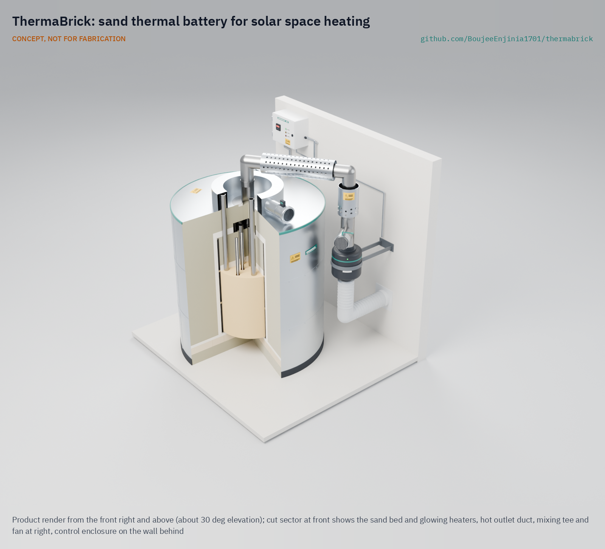
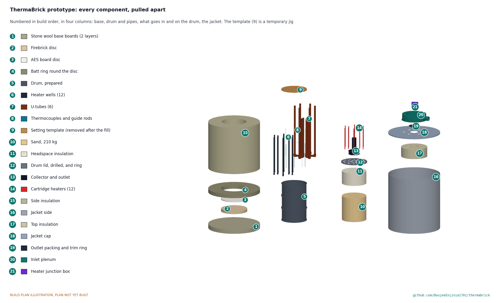

# ThermaBrick

  

**Area:** CleanTech · **TRL:** 3 of 9 (proof of concept) · **Status:** Concept · **Value-engineering target:** USD 728, the test article budget decided by Amish on 2026-09-25 (on hold with TRL 4); estimated cost of the constructable full-scale design USD 3,854 (USD 3,126 over the target) · **Difficulty:** 3 of 5

Sand thermal battery in an insulated steel drum. Resistive elements charge it from surplus PV, and a fan pulls hot air out for space heating.

[Exploded render](media/render-exploded.png) · [Detail render](media/render-detail.png) · [Interactive 3D model](media/viewer.html) · [Concept blueprint (PDF)](media/concept-blueprint.pdf) · [General arrangement TBK-DWG-001 (PDF)](cad/drawings/TBK-DWG-001.pdf) · [Sizing calculations](docs/04-calcs/TBK-CAL-001-sizing.md) · [Prototype build plan](docs/05-build-plan.md) · [Design decisions](docs/06-design-decisions.md) · [Review note](docs/REVIEW.md)

> **Out-of-phase work archived (2026-09-25).** The portfolio is capped at TRL 3, and TRL 4 is on hold by Amish's instruction. The reduced-scale test article, its test plan and report template, firmware, controller schematic and board, enclosure, purchasing checklist, build procedure and cut list were made in an earlier session that went past the cap. They are kept, unchanged and with full history, in [archive/out-of-phase-trl4/](archive/out-of-phase-trl4/README.md), and are not current work.

## Concept rationale

Heat is the largest energy load in a cold-climate home, and it is the one load that can be stored cheaply in an inert, abundant material. Sand costs almost nothing, does not burn and does not wear out with cycling, and quartz holds more heat per kilogram as it gets hotter. Storing midday solar surplus as heat at up to 450 °C, and releasing it as warm air in the evening, uses the surplus far better than exporting it for a few cents. It also avoids spending lithium battery cycles on a job that sand can do.

The design is open and garage-buildable because the ideas that make it work are simple and well published, while the barrier is detail: how many heater wells, how thick the insulation, how to keep the sand below its quartz inversion and the jacket cool. A standard 55 US gal drum, threaded black steel pipe, stock cartridge heaters and fiber insulation need no welding, pressure parts or machining. Publishing the model, calculations and drawings lets makers, students and community energy groups check the numbers and adapt the design to their own climate and tariff.

## Burning platform

Heat is the largest energy end use. The International Energy Agency reports that heat accounted for almost half of total final energy consumption and for 38 % of energy-related CO2 emissions in 2022, and that renewables supplied only 13 % of global heat consumption that year ([IEA, *Renewables 2023*, Heat](https://www.iea.org/reports/renewables-2023/heat)).

At the same time, grids with a lot of solar already throw some of it away. The California Independent System Operator curtailed 2.4 million MWh (2.4 TWh) of utility-scale wind and solar output in 2022, and more than 2.3 million MWh in the first nine months of 2023 ([US EIA, *Today in Energy*](https://www.eia.gov/todayinenergy/detail.php?id=60822)). Rooftop systems face the same timing problem at house scale: the surplus arrives at midday and the heating demand arrives after dark.

## Where it could be used

### By industry

| Industry | Use |
| --- | --- |
| Residential heating | Shift rooftop solar surplus into evening and night space heat in homes with a slab-on-grade utility room, basement or garage |
| Agriculture | Warm air for small greenhouses, farm workshops and livestock rooms from the farm's own PV |
| Small commercial and workshops | Background heat for workshops and small warehouses that stand empty at midday and need heat at opening time |
| Community energy groups | A documented, shared demonstrator for absorbing local solar surplus as heat instead of exporting it |
| Education and research | A teaching rig for heat transfer, thermal storage and control, with a published model and calculation note |

*Table 1. Uses by industry.*

### By country or region

| Country or region | Why it matters there |
| --- | --- |
| United States (California) | Solar output is already curtailed at grid scale, 2.4 TWh in 2022 ([US EIA](https://www.eia.gov/todayinenergy/detail.php?id=60822)), and since April 15, 2023 new rooftop systems take the Net Billing Tariff, which credits exports at avoided-cost values that are usually lower than the retail rate ([California Public Utilities Commission](https://www.cpuc.ca.gov/industries-and-topics/electrical-energy/demand-side-management/customer-generation/net-energy-metering-and-net-billing)) |
| Finland | Sand heat storage already supplies district heating there: a 200 kW, 8 MWh unit at Kankaanpää since 2022 and a 1 MW, 100 MWh unit at Pornainen since June 2025 ([Polar Night Energy](https://polarnightenergy.com/news/what-is-a-sand-battery/); see also [UNRIC](https://unric.org/en/sand-warms-up-the-finnish-polar-night/) on the Kankaanpää unit); ThermaBrick tests the idea at single-house scale |
| Australia | About 4.2 million homes and small businesses had rooftop solar by June 2025 ([Clean Energy Council, September 15, 2025](https://cleanenergycouncil.org.au/news-resources/australia-powers-ahead-on-rooftop-solar-as-nation-set-to-achieve-2030-rooftop-target-new-report)), and in South Australia the market operator can direct rooftop solar exports to be curtailed during minimum-demand events ([SA Power Networks](https://www.sapowernetworks.com.au/your-power/quality-reliability/solar-curtailment-for-minimum-system-demand-events/)); storing the surplus as heat keeps it in the home |
| China | China, the European Union and the United States account for three-quarters of recent renewable heat growth, and China dominates global solar thermal ([IEA, *Renewables 2023*, Heat](https://www.iea.org/reports/renewables-2023/heat)); a solar-to-sand store brings rooftop PV into a market already large for solar heat |
| Mongolia (Ulaanbaatar) | January temperatures fall below −20 °C, and more than half of ger-area households still heat with traditional coal stoves, pushing winter fine-particle levels in those neighborhoods above 100 times the WHO 24-hour guideline ([World Bank, 2018](https://www.worldbank.org/en/news/feature/2018/06/26/better-air-quality-in-ulaanbaatar-begins-in-ger-areas)); clean stored heat is a direct substitute for the stove |

*Table 2. Where ThermaBrick matters, by country or region.*

## What sparked the idea

The starting point was Finland's sand batteries, which store surplus renewable electricity as heat in sand for district heating. The first commercial unit, built by Polar Night Energy for the utility Vatajankoski at Kankaanpää and commissioned in 2022, is rated 200 kW and 8 MWh and feeds a network that heats homes, offices and the municipal swimming pool ([Polar Night Energy, "World's first Sand Battery"](https://polarnightenergy.com/reference/worlds-first-sand-battery/)); the United Nations Regional Information Centre reports that it holds its sand at 500 to 600 °C ([UNRIC, "Sand warms up the Finnish polar night"](https://unric.org/en/sand-warms-up-the-finnish-polar-night/)). A 1 MW, 100 MWh unit followed at Pornainen in June 2025 ([Polar Night Energy, "What is a Sand Battery?"](https://polarnightenergy.com/news/what-is-a-sand-battery/)). Those units serve district heating networks. ThermaBrick asks whether the same physics can be scaled down to one house with rooftop PV and no heating network: a drum of sand, a set of cartridge heaters and a warm-air outlet, built from parts a maker can buy.

## Problem

Surplus rooftop solar gets exported cheaply or curtailed, while heating still burns gas.

## Concept

Sand thermal battery in an insulated steel drum. Resistive elements charge it from surplus PV, and a fan pulls hot air out for space heating.

The v0.2 design, made constructable on 2026-09-30 (TBK-DDR-003), stores 18.3 kWh(th) in 210 kg of sand between 150 °C and 450 °C. Twelve 250 W heaters charge it at up to 3.0 kW, filling it in 9.6 h, and six steel U-tubes deliver 1.0 kW of warm air for about 14 h. A reduced-scale test article (about 6 kWh(th), budget $727.70) is the next step, to measure the sand and insulation properties the design depends on. It is archived and on hold with TRL 4.

| Document | ID | Version |
| --- | --- | --- |
| [Problem statement](docs/01-problem.md) | TBK-PRB-001 | 0.9 |
| [Design precis](docs/02-concept.md) | TBK-PRC-001 | 0.6 |
| [Requirements](docs/03-requirements.md) | TBK-REQ-001 | 0.10 |
| [Thermal and electrical sizing](docs/04-calcs/TBK-CAL-001-sizing.md) | TBK-CAL-001 | 0.3 |
| [General arrangement](cad/drawings/TBK-DWG-001.pdf) | TBK-DWG-001 | Rev P2 |
| [Concept sheet](media/concept-blueprint.pdf), with [hero](media/hero.png), [cutaway](media/cutaway.png) and [exploded](media/exploded.png) renders, [heat flow](media/flow.png) and [3D viewer](media/viewer.html) | TBK-DWG-006 | Rev P3 |
| [Recommendations accepted](docs/decisions/0002-recommendations-accepted.md) | TBK-DDR-002 | 0.1 |
| [Design for construction](docs/decisions/0003-design-for-construction.md) | TBK-DDR-003 | 0.1 |
| [Prototype build plan](docs/05-build-plan.md), with making sketches TBK-DWG-101 to 110 | TBK-BLD-001 | 0.1 |
| [Design decisions register](docs/06-design-decisions.md) | TBK-DEC-001 | 0.1 |
| [Purchasing checklist](archive/out-of-phase-trl4/bom/purchasing-checklist.md) (archived) | | Test article, by supplier |
| [Controller board BOM (optional, deferred; archived)](archive/out-of-phase-trl4/bom/bom-controller-board.csv) | | +$24.85 net |

## Key components

- 55 gal open-head steel drum, unlined
- Sand, 210 kg
- AES fiber blanket and stone wool insulation
- Nichrome cartridge heaters, 12 x 250 W, in steel wells
- Six 1-1/4 in steel U-tubes (discharge heat exchanger)
- Solid state relays and a safety contactor
- K-type thermocouples and an independent high-limit controller
- ESP32 controller and PV export meter
- Inline fan with mixing tee

The working bill of materials is in [bom/bom.csv](bom/bom.csv).

## Building the prototype

The [prototype build plan](docs/05-build-plan.md) (TBK-BLD-001) shows how to make each of the 21 components and put them together, with a making sketch for every made part, close-ups of the joints and a picture for every assembly step. Writing it made the design constructable: the wells and U-tubes now have a seat and fittings that match the drawings, the base and plenum can be built and fixed, the hot outlet clears the galvanized cap, and the heater leads and thermocouples reach the outside (TBK-DDR-003). Decisions still open are in the [design decisions register](docs/06-design-decisions.md). It is a plan only; building to it is TRL 4 work, which is on hold.

## Safety

> Operates at up to 550 °C inside and weighs about 415 kg. Use a dedicated 240 V circuit with a 5 mA GFCI breaker, keep the hot outlet duct guarded and 450 mm from combustibles, keep the independent high limit in service, and stand the unit on a concrete slab. See TBK-PRC-001, sections 6 and 7.

## Repository layout

| Folder | Contents |
| --- | --- |
| `docs/` | Problem, concept, requirements, calculations and design decisions |
| `cad/src/` | build123d Python source, the source of truth for all geometry |
| `cad/step/`, `cad/stl/` | Exported models for FreeCAD, other CAD tools and printing |
| `cad/drawings/` | 2D sketches and dimensioned drawings |
| `bom/` | Bill of materials |
| `electronics/` | KiCad schematics and PCB layouts (empty at TRL 3; earlier work archived) |
| `firmware/` | Microcontroller code (empty at TRL 3; earlier work archived) |
| `media/` | Renders, perspectives and photos |
| `build-log/` | Dated prototyping notes |

## Documentation

Controlled documents follow the portfolio [documentation standard](.kit/STANDARDS.md). Each carries a document ID (TBK-PRC-001 for the precis), a version and a revision history. Branded PDFs are built with `python .kit/render.py` and attached to GitHub Releases when a document is tagged, for example `TBK-PRC-001/v1.0`.

## Credits

Designed by Amish Chadha, with contributions from Ashok Kumar Chadha. See [CONTRIBUTORS.md](CONTRIBUTORS.md) for roles. To cite this design, use [CITATION.cff](CITATION.cff) (GitHub shows it as "Cite this repository").

AI assistance (Claude) was used to accelerate concept renders, prototype documentation and first-pass sizing calculations. Design direction and all decisions are Amish Chadha's, recorded in this repository's decision records (`docs/decisions/`).

## Licenses

- **Hardware** (CAD, drawings, BOM, electronics): [CERN-OHL-S v2](LICENSE)
- **Software** (firmware, scripts, notebooks): [MIT](LICENSE-SOFTWARE)

A project of the [Design Molecule](https://designmolecule.com) lab.
