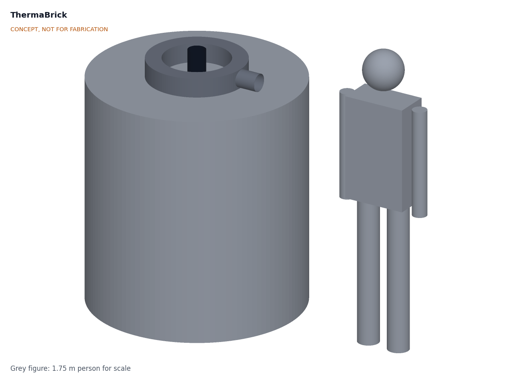

# ThermaBrick

**Area:** CleanTech · **TRL:** 3 of 9 (proof of concept) · **Status:** Concept · **Prototype budget:** $727.70 USD test article (decided by Amish, 2026-09-25; on hold with TRL 4) (full-scale estimate $3,674) · **Difficulty:** 3 of 5

Sand thermal battery in an insulated steel drum. Resistive elements charge it from surplus PV, and a fan pulls hot air out for space heating.

[Interactive 3D model](media/viewer.html) · [Concept blueprint (PDF)](media/concept-blueprint.pdf) · [General arrangement TBK-DWG-001 (PDF)](cad/drawings/TBK-DWG-001.pdf) · [Sizing calculations](docs/04-calcs/TBK-CAL-001-sizing.md) · [Review note](docs/REVIEW.md)

> **Out-of-phase work archived (2026-09-25).** The portfolio is capped at TRL 3, and TRL 4 is on hold by Amish's instruction. The reduced-scale test article, its test plan and report template, firmware, controller schematic and board, enclosure, purchasing checklist, build procedure and cut list were made in an earlier session that went past the cap. They are kept, unchanged and with full history, in [archive/out-of-phase-trl4/](archive/out-of-phase-trl4/README.md), and are not current work.

## Concept rationale

Heat is the largest energy load in a cold-climate home, and it is the one load that can be stored cheaply in an inert, abundant material. Sand costs almost nothing, does not burn and does not wear out with cycling, and quartz holds more heat per kilogram as it gets hotter. Storing midday solar surplus as heat at up to 450 °C, and releasing it as warm air in the evening, uses the surplus far better than exporting it for a few cents. It also avoids spending lithium battery cycles on a job that sand can do.

The design is open and garage-buildable because the ideas that make it work are simple and well published, while the barrier is detail: how many heater wells, how thick the insulation, how to keep the sand below its quartz inversion and the jacket cool. A standard 55 US gal drum, threaded black steel pipe, stock cartridge heaters and fiber insulation need no welding, pressure parts or machining. Publishing the model, calculations and drawings lets makers, students and community energy groups check the numbers and adapt the design to their own climate and tariff.

## Burning platform

Heat is the largest energy end use. The International Energy Agency reports that heat accounted for almost half of total final energy consumption and for 38 % of energy-related CO2 emissions in 2022, and that renewables supplied only 13 % of global heat consumption that year ([IEA, *Renewables 2023*, Heat](https://www.iea.org/reports/renewables-2023/heat)).

At the same time, grids with a lot of solar already throw some of it away. The California Independent System Operator curtailed 2.4 million MWh (2.4 TWh) of utility-scale wind and solar output in 2022, and more than 2.3 million MWh in the first nine months of 2023 ([US EIA, *Today in Energy*](https://www.eia.gov/todayinenergy/detail.php?id=60822)). Rooftop systems face the same timing problem at house scale: the surplus arrives at midday and the heating demand arrives after dark.

## Where it could be used

### By industry

| Industry | Use |
| --- | --- |
| Residential heating | Shift rooftop solar surplus into evening and night space heat in homes with a slab-on-grade utility room, basement or garage |
| Agriculture | Warm air for small greenhouses, farm workshops and livestock rooms from the farm's own PV |
| Small commercial and workshops | Background heat for workshops and small warehouses that stand empty at midday and need heat at opening time |
| Community energy groups | A documented, shared demonstrator for absorbing local solar surplus as heat instead of exporting it |
| Education and research | A teaching rig for heat transfer, thermal storage and control, with a published model and calculation note |

*Table 1. Uses by industry.*

### By country or region

| Country or region | Why it matters there |
| --- | --- |
| United States (California) | Solar output is already curtailed at grid scale, 2.4 TWh in 2022 ([US EIA](https://www.eia.gov/todayinenergy/detail.php?id=60822)), and the net billing tariff that replaced net metering in 2023 pays less for rooftop exports |
| United States (Colorado and the Mountain West) | Sunny, cold winters: a clear January day gives a large midday surplus while heating demand peaks at night, the design case in TBK-PRB-001 |
| Finland | Sand heat storage already supplies district heating there, including a 0.1 MW / 8 MWh prototype built in 2022 ([Wikipedia, Thermal energy storage](https://en.wikipedia.org/wiki/Thermal_energy_storage)); ThermaBrick tests the idea at single-house scale |
| Australia | Very high rooftop solar uptake, with export limits common on residential systems, and cool winters in the southern states |
| Northern China | Long, cold heating seasons and a large, growing rooftop solar base, where storing surplus as heat could displace coal-fired space heating |
| Ladakh, India | High-altitude desert with strong winter sun and severe cold, where homes rely on wood, dung and kerosene for heat |

*Table 2. Where ThermaBrick matters, by country or region.*

## What sparked the idea

The starting point was Finland's sand batteries, which store surplus solar and wind power as heat in sand for district heating. A 0.1 MW / 8 MWh prototype was built in 2022, and Polar Night Energy has installed a much larger sand store that works at up to 600 °C ([Wikipedia, Thermal energy storage](https://en.wikipedia.org/wiki/Thermal_energy_storage)). Those units serve whole towns through heating networks. ThermaBrick asks whether the same physics can be scaled down to one house with rooftop PV and no heating network: a drum of sand, a set of cartridge heaters and a warm-air outlet, built from parts a maker can buy.

## Problem

Surplus rooftop solar gets exported cheaply or curtailed, while heating still burns gas.

## Concept

Sand thermal battery in an insulated steel drum. Resistive elements charge it from surplus PV, and a fan pulls hot air out for space heating.

The v0.2 design stores 18.3 kWh(th) in 210 kg of sand between 150 °C and 450 °C. Twelve 250 W heaters charge it at up to 3.0 kW, filling it in 9.6 h, and six steel U-tubes deliver 1.0 kW of warm air for about 14 h. A reduced-scale test article (about 6 kWh(th), budget $727.70) is the next step, to measure the sand and insulation properties the design depends on. It is archived and on hold with TRL 4.

| Document | ID | Version |
| --- | --- | --- |
| [Problem statement](docs/01-problem.md) | TBK-PRB-001 | 0.8 |
| [Design precis](docs/02-concept.md) | TBK-PRC-001 | 0.5 |
| [Requirements](docs/03-requirements.md) | TBK-REQ-001 | 0.9 |
| [Thermal and electrical sizing](docs/04-calcs/TBK-CAL-001-sizing.md) | TBK-CAL-001 | 0.2 |
| [General arrangement](cad/drawings/TBK-DWG-001.pdf) | TBK-DWG-001 | Rev P1 |
| [Concept sheet](media/concept-blueprint.pdf), with [hero](media/hero.png), [cutaway](media/cutaway.png) and [exploded](media/exploded.png) renders, [heat flow](media/flow.png) and [3D viewer](media/viewer.html) | TBK-DWG-006 | Rev P2 |
| [Recommendations accepted](docs/decisions/0002-recommendations-accepted.md) | TBK-DDR-002 | 0.1 |
| [Purchasing checklist](archive/out-of-phase-trl4/bom/purchasing-checklist.md) (archived) | | Test article, by supplier |
| [Controller board BOM (optional, deferred; archived)](archive/out-of-phase-trl4/bom/bom-controller-board.csv) | | +$24.85 net |

## Key components

- 55 gal open-head steel drum, unlined
- Sand, 210 kg
- AES fiber blanket and stone wool insulation
- Nichrome cartridge heaters, 12 x 250 W, in steel wells
- Six 1-1/4 in steel U-tubes (discharge heat exchanger)
- Solid state relays and a safety contactor
- K-type thermocouples and an independent high-limit controller
- ESP32 controller and PV export meter
- Inline fan with mixing tee

The working bill of materials is in [bom/bom.csv](bom/bom.csv).

## Safety

> Operates at up to 550 °C inside and weighs about 410 kg. Use a dedicated GFCI-protected 240 V circuit, keep the independent high limit in service, and stand the unit on a concrete slab. See TBK-PRC-001, sections 6 and 7.

## Repository layout

| Folder | Contents |
| --- | --- |
| `docs/` | Problem, concept, requirements, calculations and design decisions |
| `cad/src/` | build123d Python source, the source of truth for all geometry |
| `cad/step/`, `cad/stl/` | Exported models for FreeCAD, other CAD tools and printing |
| `cad/drawings/` | 2D sketches and dimensioned drawings |
| `bom/` | Bill of materials |
| `electronics/` | KiCad schematics and PCB layouts (empty at TRL 3; earlier work archived) |
| `firmware/` | Microcontroller code (empty at TRL 3; earlier work archived) |
| `media/` | Renders, perspectives and photos |
| `build-log/` | Dated prototyping notes |

## Documentation

Controlled documents follow the portfolio [documentation standard](.kit/STANDARDS.md). Each carries a document ID (TBK-PRC-001 for the precis), a version and a revision history. Branded PDFs are built with `python .kit/render.py` and attached to GitHub Releases when a document is tagged, for example `TBK-PRC-001/v1.0`.

## Licenses

- **Hardware** (CAD, drawings, BOM, electronics): [CERN-OHL-S v2](LICENSE)
- **Software** (firmware, scripts, notebooks): [MIT](LICENSE-SOFTWARE)

A project of the [Design Molecule](https://designmolecule.com) lab.
