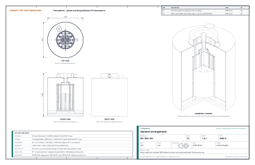

# ThermaBrick design precis

ThermaBrick is a 55 US gal steel drum filled with 210 kg of dry silica sand, insulated to 1.21 m diameter and charged by twelve 250 W cartridge heaters from surplus rooftop PV. It stores 18.3 kWh(th) between 150 °C and 450 °C. It fills in 9.6 h at up to 3.0 kW, then delivers 1.0 kW of warm air for 14.3 h through six steel U-tubes buried in the sand. The design needs no welding and no pressure parts. It keeps all sand below the 573 °C quartz inversion and the jacket below 30 °C. Its weaknesses are cost, standby loss and charge time. The constructable design's parts are estimated at $3,854 (TBK-DDR-003), USD 3,126 over the USD 728 value-engineering target. It releases 459 W passively at full charge. With that loss running, a full charge takes 9.6 h, against the 8 h in R3. A reduced-scale test article (TBK-PRC-002, budget $727.70 decided by Amish on 2026-09-25) will measure the sand and loss properties behind all three before the full-scale build. It is archived and on hold with TRL 4.

| Parameter | Value |
| --- | --- |
| Storage | 210 kg dry silica sand in an unlined 55 US gal open-head drum |
| Usable heat | 18.3 kWh(th), 150 to 450 °C energy-weighted mean |
| Charge | 12 cartridge heaters of 250 W in steel wells; 3.0 kW, 12.5 A at 240 V |
| Charge time from empty | 10.9 kWh in 4 h; full in 9.6 h |
| Discharge | Six 1-1/4 in U-tubes; 1.0 kW for 14.3 h, to 154 °C sand mean; 1.5 kW boost for 8.1 h |
| Supply air | 30 L/s at 50 °C (1.0 kW), mixed from exchanger outlet air and room air |
| Standby loss | 459 W at full charge; 8.7 kWh over 24 h idle |
| Envelope and mass | 1,209 mm diameter by 1,462 mm high; about 415 kg in service |
| Controls | ESP32, seven thermocouple channels, live PV export from an energy meter, independent 600 °C hardware limit |
| Parts cost | $3,854 estimated (bom/bom.csv), against a USD 728 value-engineering target |

*Table 1. Key parameters of the v0.2 design.*

*Figure 1. General arrangement, TBK-DWG-001 Rev P2, generated from `cad/src/model.py`. The front view is a section with the sand omitted; the isometric view has one quarter cut away.*

## 1. Architecture

ThermaBrick has five subsystems. Heat flows between them in one direction during charge and the other during discharge, and the sand never moves.

1. **Storage vessel and medium.** The drum holds the sand bed, 571 mm deep, with a 299 mm stack of insulation in the headspace above it.
2. **Charge subsystem.** Twelve cartridge heaters sit in capped steel wells in two rings of six. Heat conducts from each well into the surrounding sand.
3. **Discharge subsystem.** Six U-tubes run through the bed. Room air flows down the outer legs, across the drum floor and up the inner legs into a collector on the lid. From there a steel duct carries it to a mixing tee, where room air tempers it before the fan delivers it.
4. **Insulation envelope.** The side is insulated with AES blanket and stone wool, the top with a stack in the headspace plus more over the lid, and the base with board and firebrick. A galvanized jacket covers it all.
5. **Controls and safety.** An ESP32 reads the thermocouples and the grid export meter. It drives two SSRs and the inlet damper, and controls the fan. A separate hardware limit opens a contactor if a well wall passes 600 °C.

## 2. Storage vessel and medium

The vessel is a new, unlined, open-head 55 US gal steel drum (571.5 mm inside diameter, 883 mm high) with a bolted lid. It carries no pressure: the lid penetrations are gasketed with AES rope but not sealed, so the bed breathes to the room. Most of the drum wall stays near the 432 °C sand temperature midway between wells. Beside the outer ring of wells, 41 mm from the wall, it may reach about 480 °C at full charge. Mild steel keeps adequate strength at that temperature and scales only slowly; R8 caps the wall at 500 °C.

The medium is 210 kg of washed silica sand, sieved to remove fines and dried in place during commissioning. Silica sand was chosen over basalt, olivine or brick for cost and availability. Its one drawback is the alpha to beta inversion of quartz at 573 °C, so the controller keeps the hottest sand, at the well walls, at or below 550 °C. The heat capacity of quartz rises from 916 J/(kg K) at 150 °C to 1,162 J/(kg K) at 450 °C, which is why 210 kg is enough (TBK-CAL-001, section 2).

## 3. Charge subsystem

Heat input is limited by how fast dry sand conducts heat, not by heater rating. The sand conducts only about 0.3 W/(m K), so twelve wells are used instead of six. That cuts the full-charge time from over 30 h to 9.6 h at the same 3.0 kW, with standby loss counted (TBK-CAL-001, Table 9).

- **Heaters.** 5/8 in by 20 in cartridge heaters, 250 W at 240 V, with an Incoloy 800 sheath, NiCr 80/20 winding in MgO and ceramic-beaded nickel leads. The surface load is 1.1 W/cm², and the hottest calculated sheath temperature is 634 °C against a 760 °C rating.
- **Wells.** 3/4 in Sch 40 black steel pipe, 906 mm long, with a threaded malleable iron cap at the bottom. The wells stand on the drum floor in rings of 150 mm and 245 mm radius and end 25 mm above the lid, so no steel crosses the top insulation. The heater leads rise through the insulation to a junction box on the jacket top. Any heater can be drawn out and replaced from above.
- **Switching.** Two groups of six heaters, each on a zero-cross SSR, with burst-fire control over 1 s windows. A 2-pole contactor upstream opens both legs whenever a hardware limit trips.
- **Charge profile.** Full 3.0 kW for the first 3.2 h, then tapering as the well walls reach 550 °C, to 1.2 kW at full charge (TBK-CAL-001, Figure 1).

## 4. Discharge subsystem

Air never touches the sand. Six closed U-tubes of 1-1/4 in black steel pipe carry it, so no dust is carried into the room and the pressure drop stays low (107 Pa at 25 L/s). Table 2 traces the air path.

| Step | Component | Air temperature |
| --- | --- | --- |
| 1 | Room air enters the 4 in inlet collar on the annular inlet plenum on the jacket top, through a servo-driven damper | 20 °C |
| 2 | Down the six outer legs (radius 235 mm), across the drum floor, up the six inner legs (radius 80 mm) | Rising |
| 3 | Into the 10 in collector on the lid, then up the 4 in steel outlet, which rises and turns down as a heat trap | Up to 314 °C |
| 4 | Mixing tee: room air joins through a manual balancing damper | 50 °C setpoint |
| 5 | 4 in EC inline fan, then insulated flexible duct to the room register | 50 °C or below |

*Table 2. Discharge air path.*

The controller sets heat output with the inlet damper and holds the supply air at 50 °C with fan speed. At full charge 2.8 L/s through the exchanger carries 1.0 kW. As the bed cools the damper opens, up to 25 L/s at a 154 °C sand mean (TBK-CAL-001, Figure 2). Of the 18.3 kWh stored, 14.5 kWh leaves as controlled output and 3.8 kWh as standby loss into the same room. The inlet damper sits on the cold side, so an ordinary galvanized butterfly and a hobby servo can do the job. When it closes, the heat-trap bend in the outlet stops convection through the tubes.

## 5. Controls and instrumentation

The ESP32 runs three modes, and more than one can be active at once.

- **Charge.** When the meter shows export above 150 W, the controller raises heater power by the export less a 100 W margin, up to 3.0 kW. A PI loop on the hotter of the two well-wall thermocouples holds 550 °C, and charging stops at 100 % state of charge.
- **Discharge.** When the room is below its setpoint, or on a schedule, the damper opens under PI control on estimated heat output, and the fan holds supply air at 50 °C.
- **Idle and fault.** The heaters are off and the damper is closed. On a controller reset, loss of the export signal for 60 s, an open thermocouple or a supply-air reading above 65 °C, the controller drops into this mode and stays there until the fault clears.

State of charge is the energy-weighted mean of the four sand thermocouples, converted through the quartz enthalpy curve. The weights will be calibrated against the calorimetric test for R18.

| Tag | Location | Sensor | Purpose |
| --- | --- | --- | --- |
| T1, T2 | Well wall, one ring A and one ring B well, mid heated length | Type K, MI 3 mm | Charge limit, 550 °C |
| T3 | Well wall, second ring A well | Type K, MI 3 mm | Independent hardware limit, 600 °C |
| T4 to T6 | Sand at mid-depth: center; 200 mm radius; 270 mm radius | Type K, MI 3 mm | State of charge, radial gradient |
| T7 | Sand 100 mm below the surface, 200 mm radius | Type K, MI 3 mm | State of charge, top of bed |
| T8 | Collector air | Type K, MI 3 mm | Exchanger outlet, heat output estimate |
| A1 to A3 | Room, supply air, jacket surface | DS18B20 | Comfort control, supply limit, surface check |
| E1 | Main panel, grid conductors | Energy meter with 50 A CTs | PV export signal |

*Table 3. Instrumentation.*

## 6. Build and commissioning

The prototype build plan TBK-BLD-001 (`docs/05-build-plan.md`) gives the full, illustrated sequence for the constructable design (TBK-DDR-003); this section is the summary. The build takes about three weekends. It needs a pipe threader (rental), a drill with hole saws, snips and a rivet gun.

1. **Drum.** Strip the exterior paint, then burn the drum empty outdoors to 300 °C to remove residues. Drill the lid through a plywood setting template made from the model: twelve 36 mm holes for the wells (each also passes a well-wall thermocouple), twelve 48 mm holes for the U-tube legs and four 6 mm holes for the sand thermocouples.
2. **Base.** Lay two layers of stone wool board over the full diameter on the slab. Add a 610 mm disc of insulating firebrick under the drum footprint and a 25 mm AES board disc on top, with a ring of 89 mm stone wool batt round them out to the jacket.
3. **Internals.** Set the drum on the base. Level a 14 mm first lift of sand and stand the capped wells on it; stand the U-tubes (two elbows and a 4 in nipple each) on the floor. Fix thermocouples T1 to T3 to the wells and T4 to T7 to stainless guide rods, then clamp the setting template on the rim to hold every pipe upright during the fill.
4. **Sand.** Fill in 100 mm lifts to 571 mm, settling each lift around the pipes by rodding. Weigh every bag; the total is 210 kg.
5. **Top and side.** In the headspace, lay 50 mm of AES blanket on the sand and fill the rest with stone wool, cut around the pipes. Lift off the template and fit the lid, ring, collector (riveted to the lid by six tabs) and outlet. Wrap two layers of AES blanket and three of stone wool around the drum. Close the jacket, add the top insulation, the screwed top cap with the outlet trim ring, and the inlet plenum, then connect the ducts.
6. **Electrical.** Drop the heaters into the wells before the top insulation goes on and land their 72 in leads in the junction box on the cap. Wire the enclosure, then have the 240 V circuit connected.
7. **Bake-out.** Check each heater's insulation resistance; it should read 1 MΩ or more at 500 V. Hold the bed at a 150 °C sand mean for 24 h with the collector outlet open and the room ventilated, to drive out moisture and burn off the stone wool binder. Then step to 300 °C and finally 450 °C, logging throughout.

> **Safety:** Respirable crystalline silica. Fill the drum outdoors or with local exhaust, and wear a P100 or N95 respirator while pouring and sieving sand.

> **Safety:** Fiber insulation. AES and stone wool fibers irritate skin, eyes and airways. Wear gloves, long sleeves, eye protection and a respirator while cutting and fitting.

> **Safety:** First firing. Binder burn-off and residual coatings release smoke and odor up to about 350 °C. Keep the space ventilated and occupied only as needed until the bake-out is complete.

## 7. Safety design

The design layers its protection so that no single failure can overheat the unit.

- **Temperature limits.** The ESP32 limits the well walls to 550 °C. The independent limit controller on T3 opens the 2-pole contactor at 600 °C and latches until reset by hand. The heaters are rated to 760 °C, so even a failure of both limits would leave some margin. An SSR that fails shorted is the most likely single failure, and it is covered by the contactor.
- **Electrical.** Dedicated 20 A circuit with a 2-pole 5 mA GFCI breaker, supplementary 10 A fuses per group and a steel enclosure. 30 mA equipment ground-fault protection is used only if the heaters still trip the 5 mA device after bake-out and the installing electrician confirms the code allows it at that location (decided 2026-10-02). The heater junction box on the jacket top stays near room temperature.
- **Surfaces.** The jacket runs at 26 °C at full charge. The hot outlet duct, up to 314 °C, is the only hot part outside the jacket. It is guarded by a perforated steel sleeve and kept 450 mm from combustibles, as for single-wall stovepipe. These siting rules, with the heat trap in the outlet run and the fan below the mixing tee, are requirements an installer must meet (R15, decided 2026-10-02).
- **Warning labels.** Hot-surface and 240 V warning labels go on the jacket, outlet guard, junction box and enclosure (decided 2026-10-02; one BOM line, about USD 15, to be added).
- **Materials.** No zinc, paint, liner or plastic above 200 °C. The jacket is galvanized, but it runs cold. AES fiber replaces refractory ceramic fiber, which is classed as a possible carcinogen.
- **Structure.** The unit weighs about 415 kg and must stand on a concrete slab; wood floors are not permitted.

> **Safety:** Stored energy. A charged unit stays hot for days after power is removed. Label it, and do not open the lid or pull a heater until the sand mean reads below 60 °C.

## 8. Key design decisions and risks

The choices in Table 4 were proposals by the designer. Amish accepted all of them on 2026-09-25, and they are recorded in design decision record TBK-DDR-002 (`docs/decisions/0002-recommendations-accepted.md`).

| No. | Decision | Alternatives considered | Reason | Status |
| --- | --- | --- | --- | --- |
| D1 | Silica sand, window 150 to 450 °C | Basalt, olivine or soapstone to 600 °C and above | Cost and availability. The window keeps all sand below the 573 °C quartz inversion, and the 150 °C floor is where 1.0 kW output ends. | Decided by Amish, 2026-09-25: go with recommendation |
| D2 | Cartridge heaters in capped wells | Bare nichrome coils buried in sand; electric air heater in a closed air loop | Replaceable from the top without removing sand; heaters isolated from sand and moisture; standard parts | Decided by Amish, 2026-09-25: go with recommendation |
| D3 | Twelve wells of 250 W | Six of 500 W; six of 1-1/2 in; nine of 333 W; twelve of 1 in | Fastest affordable layout: 9.6 h against 15.2 h or more for fewer wells. Twelve 1 in wells reach 8.4 h at higher cost (TBK-CAL-001, Table 9) | Decided by Amish, 2026-09-25: go with recommendation |
| D4 | Closed U-tubes for discharge | Air blown directly through the sand bed | No dust in room air, low pressure drop and no fluidization risk | Decided by Amish, 2026-09-25: go with recommendation |
| D5 | Cold-side damper with a mixing tee and heat trap | Hot-side damper; fan pushing through the bed | Room-temperature damper and fan; convection stopped with no moving parts | Decided by Amish, 2026-09-25: go with recommendation |
| D6 | Wells end at the lid | Wells run through the top insulation | Removes a 94 W thermal bridge | Decided by Amish, 2026-09-25: go with recommendation |
| D7 | AES fiber hot face, stone wool bulk | Refractory ceramic fiber throughout | Handling safety and cost | Decided by Amish, 2026-09-25: go with recommendation |
| D8 | 240 V, 3.0 kW, burst-fire SSRs plus contactor | 120 V at 1.8 kW | Only 240 V can absorb a full sunny day's surplus; the contactor covers SSR failure | Decided by Amish, 2026-09-25: go with recommendation |

*Table 4. Key design decisions.*

The main technical risks are as follows.

- **Thermal ratcheting.** The sand expands while the drum is still cool, then settles into the gap when the drum expands, and the drum may grow a little each cycle. Heating from the core outward helps, and R19 sets a 1 % growth limit to watch. A compressible AES liner inside the drum wall is the fallback if growth appears.
- **Sand conductivity.** If the sand conducts 20 % less heat than assumed, the charge time grows to 12.1 h (TBK-CAL-001, Table 8). The test article will fit the real value.
- **GFCI nuisance trips.** Twelve MgO heaters leak a little current when damp. Bake-out usually cures this. The design specifies a 5 mA GFCI breaker; a 30 mA equipment ground-fault device is a measured exception, used only if the heaters still trip the 5 mA device after bake-out and the installing electrician confirms the code allows it (decided 2026-10-02).
- **Cost.** At $3,854, the parts cost about five times the USD 728 value-engineering target. Heaters, insulation and pipe account for 53 % of it (`bom/bom-notes.md`). The prototype budget now funds the test article, at $727.70 (decided by Amish, 2026-09-25).
- **Charge time.** With standby loss counted, a full charge takes 9.6 h against the 8 h in R3. The options are to cut loss (TBK-CAL-001, Table 5), move to twelve 1 in wells (8.4 h), or relax R3 to 10 h. Decided by Amish, 2026-09-25 (TBK-DDR-002): choose after the test article has measured sand conductivity and loss. That choice is on hold with TRL 4.

## 9. Open questions

- [x] Decide the budget path. Amish decided on 2026-09-24 to build the reduced-scale test article (TBK-PRC-002) first, and on 2026-09-25 set its budget at $727.70 and accepted revisiting the full-scale budget with its results (TBK-DDR-002). Both are on hold with TRL 4.
- [ ] Close the R3 charge-time gap of 1.6 h (section 8, charge time risk). Decided: choose the fix after the test article measures sand conductivity (TBK-DDR-002); on hold with TRL 4.
- [x] Accept 459 W standby loss, or adopt the stainless leg sections and microporous panel (TBK-CAL-001, Table 5). Decided 2026-10-02 (TBK-DEC-001): accept 459 W for now; decide the upgrade together with the R3 charge-time fix once the test article has measured loss.
- [ ] Confirm the fan's pressure curve and speed-control interface against 60 L/s at 150 Pa.
- [ ] Confirm the compressive strength of the stone wool base board on the data sheet (60 kPa or more).
- [x] Choose between a 5 mA GFCI and 30 mA equipment protection with the electrician. Decided 2026-10-02 (TBK-DEC-001): a 2-pole 5 mA GFCI breaker; 30 mA equipment ground-fault protection only if the heaters still trip it after bake-out and the installing electrician confirms the code allows it at that location.
- [ ] Controller schematic, firmware and test plan TBK-TST-001: drafted for the test article in an earlier session and archived under `archive/out-of-phase-trl4/`; on hold with TRL 4.
- [x] Review proposals D1 to D8. Accepted by Amish on 2026-09-25 and recorded in TBK-DDR-002.

## 10. Deliverables in this revision

| Item | Location |
| --- | --- |
| Problem statement v0.2 | `docs/01-problem.md` (TBK-PRB-001) |
| Requirements v0.2 | `docs/03-requirements.md` (TBK-REQ-001) |
| Sizing calculation v0.2 and script | `docs/04-calcs/` (TBK-CAL-001) |
| Test article precis, sizing, drawing and BOM (archived, on hold with TRL 4) | TBK-PRC-002, TBK-CAL-002, TBK-DWG-002, `bom/bom-test-article.csv`, all under `archive/out-of-phase-trl4/` |
| Parametric model | `cad/src/model.py`; exports in `cad/step/` and `cad/stl/` |
| General arrangement, Rev P2 | `cad/drawings/TBK-DWG-001` (SVG, PDF, PNG), built by `cad/src/sheets.py` |
| Bill of materials | `bom/bom.csv` and `bom/bom-notes.md` |

*Table 5. Deliverables of the v0.2 draft.*
