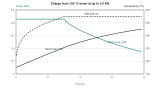
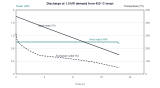

# ThermaBrick thermal and electrical sizing

An unlined 55 US gal drum holding 210 kg of dry silica sand stores 18.3 kWh(th) between a mean sand temperature of 150 °C and 450 °C. Twelve 250 W cartridge heaters (3.0 kW at 240 V) charge it fully in 7.9 h from surplus PV. They store 15.7 kWh in the first 6 h without any sand exceeding 550 °C. Six 1-1/4 in steel U-tubes then deliver a steady 1.0 kW of heated air for 18 h, until the sand mean falls to 155 °C. Standby loss is 459 W at full charge. That heat is released into the room where the unit stands, so ThermaBrick must stand inside the heated space. Table 1 summarizes the results.

| Quantity | Result | Requirement (TBK-REQ-001) |
| --- | --- | --- |
| Stored heat, 150 to 450 °C sand mean | 18.3 kWh(th) | R1: 18 kWh(th) or more |
| Sand mass and fill depth | 210 kg, 571 mm | R1 |
| Charge power | 3.0 kW, 12.5 A at 240 V | R2, R11 |
| Heat stored after 4 h and 6 h of full surplus | 11.7 kWh and 15.7 kWh | R3: 11 kWh in 4 h |
| Time to full charge from 150 °C | 7.9 h | R3: 8 h or less |
| Peak sand, well-wall, sheath and drum-wall temperature | 550 °C, 550 °C, 634 °C, about 480 °C | R8: 550 °C, 550 °C, 700 °C, 500 °C |
| Rated output held until sand mean reaches | 1.0 kW, 155 °C | R4: 170 °C or lower |
| Boost output held until sand mean reaches | 1.5 kW for 9.7 h, 220 °C | R5: 8 h or more |
| Standby loss at 450 °C, 300 °C and 150 °C | 459 W, 259 W, 103 W | R7: 500 W or less |
| Heat lost in 24 h idle from full | 8.7 kWh (47 % of window) | R7: 9 kWh or less |
| Jacket surface temperature, side | 26 °C | R9: 45 °C or less |
| Operating mass and load on the floor slab | 410 kg; 3.5 kPa average | R15: 450 kg or less |

*Table 1. Summary of sizing results against the requirements.*

## 1. Basis and method

All numbers in this note come from `docs/04-calcs/tbk_cal_001.py`. The script imports the geometry from `cad/src/model.py`, so the calculation, the CAD model and drawing TBK-DWG-001 share one set of dimensions. Run it from the repo root with `python docs/04-calcs/tbk_cal_001.py`; it prints every value quoted here and redraws Figures 1 and 2.

The design basis is as follows.

- Room air and ambient at 20 °C. The unit stands indoors on a concrete slab.
- The usable window is defined on the energy-weighted mean sand temperature: empty at 150 °C, full at 450 °C. Below 150 °C the exchanger cannot hold 1 kW (section 4). Above 450 °C the sand near the heater wells would pass 550 °C during charge.
- No sand anywhere exceeds 550 °C. Quartz undergoes the alpha to beta inversion at 573 °C with a step volume change of about 0.8 %. Cycling through it cracks grains, makes fines and raises the ratcheting load on the drum. The well wall is the hottest point in the sand, so the controller limits well-wall temperature to 550 °C.
- Supply is 240 V split phase on a dedicated 20 A circuit, the normal North American arrangement for a fixed heating appliance.

## 2. Storage capacity

The stored heat is the sensible enthalpy change of the sand across the window:

`E = m × ∫ cp(T) dT, from 150 °C to 450 °C`

Assumptions:

- The sand is dry silica sand with the heat capacity of alpha quartz, from the NIST Shomate fit (298 to 847 K). Moisture is driven off during the first bake-out (TBK-PRC-001, section 6).
- Bulk density is 1,600 kg/m³ for dry, lightly tamped washed sand.
- Heat stored in the steel drum, pipes and inner insulation is ignored. It adds roughly 1 kWh and is held as margin.

Heat capacity rises steeply with temperature (Table 2). Using a constant 800 J/(kg K), a common rule of thumb, would understate the capacity by 24 % and oversize the sand charge.

| Temperature | cp of quartz |
| --- | --- |
| 20 °C | 733 J/(kg K) |
| 150 °C | 916 J/(kg K) |
| 450 °C | 1,162 J/(kg K) |
| Mean, 150 to 450 °C | 1,048 J/(kg K) |

*Table 2. Specific heat of quartz sand across the operating range.*

The enthalpy change over the window is 314.3 kJ/kg, so 18 kWh(th) needs 206.1 kg. The design fill is 210 kg, which stores **18.3 kWh(th)**. At 1,600 kg/m³ that is 131.3 L. After deducting the wells and U-tubes, the open cross-section of the drum is 0.233 m². The fill depth is 571 mm above the drum floor, including 8 mm for the U-bends and well caps at the bottom. The CAD model's sand body at that depth holds 209.2 kg, which agrees within 0.4 %.

## 3. Charge

### 3.1 Heater layout and limits

Twelve 5/8 in cartridge heaters, 250 W each at 240 V, sit in 3/4 in Sch 40 black steel wells. The wells stand in two rings of six at radii 150 mm and 245 mm, on the rays between the U-tubes. Each heater's share of the bed is a circle of 79.7 mm radius around a well of 13.35 mm outside radius.

Sand conductivity limits the charge rate, not heater power. Dry packed sand conducts only about 0.3 W/(m K), so the temperature drop across the sand near a well is large. An early layout with six 500 W heaters hit the well-wall limit early, averaged only 1.0 kW and needed 17.6 h to fill. Doubling the well count halves each heater's share of the bed, which cuts the diffusion distance. It also halves the heat each well must pass. Section 8 compares the layouts that were considered.

### 3.2 Model

Each heater cell is modeled as a one-dimensional radial finite-volume problem (60 cells, implicit time steps of 120 s). Heat enters at the well wall and the outer boundary is adiabatic. The controller in the model does what the firmware will do. At each step it applies the largest power, up to 250 W per heater, that keeps both limits:

- well-wall temperature at or below 550 °C (thermocouple clamped to the well at mid-depth), and
- heater sheath temperature at or below 700 °C, found from radiation and air conduction across the 2.5 mm gap between the sheath and the well bore.

Assumptions:

- Sand conductivity k = 0.27 + 2.1 × 10⁻⁴ (T − 20) W/(m K), with T in °C: 0.30 W/(m K) at 150 °C and 0.36 W/(m K) at 450 °C. Published values for dry quartz sand at 400 to 500 °C run from 0.35 to 0.50 W/(m K) as radiation between grains grows, so the fit is conservative.
- Contact conductance between the pipe wall and packed sand is 300 W/(m² K).
- Heater power spreads over the 563 mm equivalent bed depth. The heated length runs from 26 mm to 483 mm above the drum floor. The 88 mm of sand above it and the 26 mm below it charge by axial conduction.
- Emissivity 0.80 for the oxidized Incoloy sheath and 0.70 for the oxidized steel bore.
- Charge starts from a uniform 150 °C.

### 3.3 Results

The heaters run at the full 3.0 kW for 3.1 h. The well wall then reaches 550 °C, and the controller tapers the power to 1.2 kW by the end of charge (Figure 1 and Table 3). The mean charge power is 2.33 kW. The hottest sheath temperature is 634 °C at the start of the taper. That leaves 66 K of margin to the 700 °C control limit and 126 K to the 760 °C element rating. At full charge the sand ranges from 432 °C midway between wells to 543 °C beside them, so none passes the quartz inversion. The outer ring of wells stands 41 mm from the drum wall, where the modeled sand is at 461 °C. Because the wall is insulated, it reflects heat back toward the well, so the wall itself may run about 20 K hotter. The drum wall is therefore taken as about 480 °C at those spots, within the 500 °C limit of R8. A temporary drum-wall thermocouple on the first build will confirm it.

*Figure 1. Charge from empty. Power is held at 3.0 kW until the well wall reaches 550 °C at 3.1 h, then tapers.*

| Elapsed time | Heater power | Sand mean | Heat stored in window |
| --- | --- | --- | --- |
| 2 h | 3.00 kW | 256 °C | 6.0 kWh |
| 4 h | 2.40 kW | 348 °C | 11.7 kWh |
| 6 h | 1.69 kW | 411 °C | 15.7 kWh |
| 7.9 h | 1.22 kW | 450 °C | 18.3 kWh |

*Table 3. Charge progress with a full 3.0 kW of surplus available throughout.*

In winter the PV surplus is usually less than 3 kW, and the controller simply follows it. Section 1 of TBK-PRB-001 estimates that a typical sunny winter day offers 8 to 14 kWh of surplus. That is well inside what the bed can absorb in 6 h.

### 3.4 Heater rating check

At 250 W over an 18 in (457 mm) heated length on a 15.9 mm sheath, the surface load is 1.10 W/cm² (7.1 W/in²). That is low for a cartridge heater and suits a loose fit in a well, where the element gets no conduction from a tight bore. Each heater draws 1.04 A and has a hot resistance of 230 Ω.

## 4. Discharge

### 4.1 Exchanger and model

Six U-tubes of 1-1/4 in Sch 40 black steel pipe (42.2 mm outside, 35.1 mm bore) carry room air through the bed. Air enters the outer legs at a radius of 235 mm, crosses the drum floor, and rises in the inner legs at 80 mm into a collector on the lid. Each U-tube has 1.30 m of heated length. Each of the twelve legs is modeled as a radial sand cell of 81.4 mm outer radius. The same finite-volume method is used, with heat leaving at the pipe wall.

On the air side, the model uses Gnielinski's correlation for turbulent flow and Hausen's developing-flow correlation for laminar flow, blended linearly between Reynolds numbers of 2,300 and 4,000. The air outlet temperature follows from the log-mean relation for a tube at uniform wall temperature. Air properties are taken at the mean air temperature.

The controller meets a heat demand by setting the exchanger airflow with the inlet damper. The fan then adds room air through the bypass so the mixed supply leaves at 50 °C. Airflow through the exchanger is capped at 25 L/s.

### 4.2 Results

At full charge the exchanger meets 1.0 kW with only 2.8 L/s of air, which leaves at 314 °C. As the bed cools, the controller opens the damper (Figure 2). Output holds at 1.0 kW for 18.1 h, until the sand mean reaches 155 °C and the airflow reaches its 25 L/s cap. At the 150 °C floor the output is 940 W. The discharge from 450 °C to 150 °C returns the full 18.3 kWh. A 1.5 kW boost can be held for 9.7 h, down to a sand mean of 220 °C.

*Figure 2. Discharge from full at a 1.0 kW demand. The kink in outlet temperature near 4 h is where airflow crosses into the laminar-to-turbulent transition range.*

### 4.3 Air path and fan

A 1.0 kW output with supply air at 50 °C and room air at 20 °C needs 30.4 L/s (64 cfm) of total supply flow; the 1.5 kW boost needs 45.6 L/s. At the 25 L/s cap the exchanger's pressure drop is 107 Pa. That includes pipe friction at an absolute roughness of 0.045 mm, entry and exit losses, and two threaded elbows with K = 1.5 each. Inlet velocity is 4.3 m/s. The fan therefore needs at least 60 L/s at 150 Pa. A 4 in EC inline fan meets that with margin. Hot air up to 314 °C runs only in the collector and the steel outlet duct, and is mixed down before it reaches the fan.

## 5. Standby loss and retention

Heat leaks out through the side, the top and the base, and along the pipes that cross the top insulation. The loss is computed as a set of series thermal resistances. Each layer's conductivity is taken at its own mean temperature, and the interface temperatures are solved iteratively.

Assumptions:

- AES blanket (128 kg/m³): k = 0.035 + 1.0 × 10⁻⁴ Tm + 1.5 × 10⁻⁷ Tm² W/(m K), with Tm the layer mean in °C.
- Stone wool: k = 0.035 + 1.0 × 10⁻⁴ Tm + 1.3 × 10⁻⁷ Tm² W/(m K). K-23 insulating firebrick: k = 0.12 + 1.0 × 10⁻⁴ Tm W/(m K).
- Outer surface: 6 W/(m² K) natural convection plus radiation at an emissivity of 0.9 (painted jacket).
- The heater wells end at the lid. Only the leads cross the top insulation: two 14 AWG nickel conductors per heater.
- Pipe walls crossing the insulation conduct axially with no side exchange. This is an upper bound, because the surrounding insulation carries almost the same gradient.
- A heat-trap bend in the outlet duct and the closed inlet damper stop convective flow through the exchanger at standby.

| Path | Construction | Loss at 450 °C |
| --- | --- | --- |
| Side | 50 mm AES blanket, 267 mm stone wool, jacket | 268 W |
| Top | 50 mm AES and 249 mm stone wool in the headspace, lid, 50 mm AES and 178 mm stone wool | 14 W |
| Base | 25 mm AES board, 64 mm firebrick, 100 mm stone wool board | 46 W |
| Six inlet legs | 1-1/4 in steel pipe through 528 mm of insulation | 95 W |
| Collector and outlet | 4 in stovepipe, thinner cover over the collector | 29 W |
| Heater leads | 24 nickel conductors | 7 W |
| Total | | 459 W |

*Table 4. Standby loss by path with the sand at 450 °C.*

The side dominates. The AES and stone wool interface sits at 390 °C, well inside the 650 °C limit for stone wool fiber. The side jacket runs at 26 °C. Loss falls with sand temperature, to 259 W at 300 °C and 103 W at 150 °C. Stepping this through a 24 h idle period from full charge loses 8.7 kWh, and the sand mean drops to 317 °C.

This loss is not wasted in the heating season, but it is uncontrolled. The unit therefore belongs inside the heated space, and its passive output counts toward the room's heat load. Two upgrades reduce it (Table 5). Neither is in the v0.2 BOM.

| Option | Loss at 450 °C | 24 h idle loss | Added cost |
| --- | --- | --- | --- |
| Baseline (v0.2) | 459 W | 8.7 kWh | None |
| Type 304 Sch 10 upper sections on the six inlet legs | 414 W | 7.9 kWh | About $150 |
| 25 mm microporous panel as the side hot face | 402 W | 7.9 kWh | About $300 |
| Both | 357 W | 7.1 kWh | About $450 |

*Table 5. Standby loss reduction options.*

## 6. Electrical

The twelve heaters form two groups of six in parallel, each switched by its own zero-cross SSR (Table 6).

| Quantity | Value |
| --- | --- |
| Heater resistance, hot | 230.4 Ω each |
| Group current and power | 6.25 A, 1.5 kW |
| Total current and power | 12.5 A, 3.0 kW |
| Branch circuit | 20 A, 2-pole GFCI breaker, 12 AWG copper |
| Continuous load limit (80 % of 20 A) | 16 A, so 12.5 A has 22 % margin |
| SSR on-state loss | 7.5 W each at 1.2 V drop |
| SSR heat sink | 2 K/W or better, which keeps the SSR case below 50 °C in a 30 °C enclosure |
| Supplementary fuses | 10 A class CC per group |

*Table 6. Electrical sizing.*

Burst-fire control in whole mains cycles over a 1 s window sets each group in 25 W steps, so the charge power can follow the PV surplus from 0 to 3.0 kW. A 2-pole contactor opens both legs whenever any limit in the hardware chain trips, so a shorted SSR cannot hold the heaters on. That chain includes the independent 600 °C well-wall limit.

## 7. Mass and floor load

The operating mass is about 410 kg (Table 7).

| Item | Mass |
| --- | --- |
| Sand | 210 kg |
| Twelve heater wells with caps | 18 kg |
| Six U-tubes with elbows | 55 kg |
| Drum, lid and ring | 26 kg |
| Insulation, firebrick and board | 75 kg |
| Jacket, plenum, collector and ducts | 20 kg |
| Heaters | 5 kg |
| Total | 410 kg |

*Table 7. Operating mass.*

Spread over the 1.21 m diameter footprint, the load is 3.5 kPa. That is above the 1.9 kPa (40 psf) live load that a typical residential wood floor is designed for, so ThermaBrick must stand on a concrete slab. Under the drum, the firebrick course carries 14.8 kPa into the stone wool board beneath. The board must be rated at 60 kPa or more at 10 % strain, a safety factor of 4.

## 8. Sensitivity and limitations

Table 8 varies the two least certain inputs. Charging is most sensitive to sand conductivity. Even with 20 % lower conductivity, the bed still takes 14.4 kWh in 6 h.

| Case | Time to full charge | Stored in 6 h | Sand mean where 1.0 kW ends |
| --- | --- | --- | --- |
| Base case | 7.9 h | 15.7 kWh | 155 °C |
| Sand k × 0.8 | 9.2 h | 14.4 kWh | 170 °C |
| Sand k × 1.25 | 7.0 h | 16.7 kWh | 150 °C |
| Contact conductance 150 W/(m² K) | 8.2 h | 15.3 kWh | 155 °C |

*Table 8. Sensitivity of charge and discharge performance.*

Table 9 records the heater layouts that were evaluated with the same model, all at 3.0 kW total. Twelve 1 in wells charge slightly faster, but twelve 3/4 in wells meet R3 at lower cost and leave more clearance to the U-tubes.

| Layout | Time to full charge | Stored in 6 h |
| --- | --- | --- |
| Six 3/4 in wells, 500 W each | 17.6 h | 9.4 kWh |
| Six 1-1/2 in wells, 500 W each | 11.6 h | 12.5 kWh |
| Nine 3/4 in wells, 333 W each | 10.6 h | 13.2 kWh |
| Twelve 3/4 in wells, 250 W each (selected) | 7.9 h | 15.7 kWh |
| Twelve 1 in wells, 250 W each | 7.1 h | 16.5 kWh |

*Table 9. Heater layouts considered.*

The main limitations of the method are as follows.

- The radial cells treat each pipe's share of the bed as a circle. The real hexagonal and ring spacing leaves some sand farther from a pipe than the cell radius, so local temperatures will spread more than modeled. The sand thermocouple grid (TBK-PRC-001, section 5) is placed to measure this.
- Axial conduction and the unheated sand above and below the heaters are lumped into the radial cells.
- The standby model treats each surface in one dimension and does not model the corners where side and top insulation meet.
- Sand conductivity, contact conductance and insulation conductivity are literature values. The first test (TBK-TST-001, to be written) will fit them from measured charge and cool-down curves.
