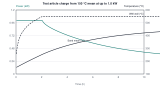
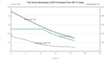

# ThermaBrick test article sizing

A 16 US gal drum holding 68 kg of sand stores 5.9 kWh(th) between 150 °C and 450 °C mean, 32 % of the full-scale unit. Its four heater cells are nearly identical to the full-scale ones: the same heater diameter and well, and a cell radius of 84.4 mm against 79.7 mm. The article therefore reproduces the charge physics that TBK-CAL-001 depends on, at one-third of the energy. On a 120 V, 1.0 kW supply it charges fully in 15.7 h, and its one U-tube holds 250 W for 8.8 h. Its standby loss of 249 W at full charge is large for its size. That is the price of a small vessel, and the loss is itself one of the quantities the article is built to measure. Table 1 summarizes the results.

| Quantity | Test article | Full scale (TBK-CAL-001 v0.2) |
| --- | --- | --- |
| Sand and stored heat | 68 kg, 5.9 kWh(th) | 210 kg, 18.3 kWh(th) |
| Heater cells | 4 × 250 W, 1.0 kW at 120 V | 12 × 250 W, 3.0 kW at 240 V |
| Heater cell radius | 84.4 mm | 79.7 mm |
| Charge power per meter of heater cell | 513 W/m | 444 W/m |
| Full power until the well wall reaches 550 °C | 2.1 h | 3.2 h |
| Time to full charge, with standby loss | 15.7 h | 9.6 h |
| Time to full charge, adiabatic cell only | 8.7 h | 7.9 h |
| Peak heater sheath temperature | 649 °C | 634 °C |
| Discharge exchanger | One U-tube; leg cell radius 120 mm | Six U-tubes; leg cell radius 81 mm |
| Standby loss at 450 °C | 249 W | 459 W |
| Standby loss per kWh stored | 42 W/kWh | 25 W/kWh |

*Table 1. Test article compared with the full-scale design.*

## 1. Method

All numbers come from `docs/04-calcs/tbk_cal_002.py`. The script takes its geometry from `cad/src/test_article.py`. It reuses every physical model in `tbk_cal_001.py` unchanged: the quartz heat capacity, sand conductivity, radial cell model, heater sheath model, U-tube air side and loss-coupled charge and discharge. The only new model is the standby loss of the smaller envelope (section 5). The assumptions of TBK-CAL-001 apply throughout.

## 2. Scale and similarity

The article is scaled so that each heater cell matches the full-scale cell. That is the region the charge model describes and the one whose sand properties are least certain. The 16 US gal open-head drum has a 343 mm bore. After the four wells and two U-tube legs, that leaves 0.0873 m² of sand, or 0.0218 m² per heater. The full scale has 0.0194 m² per heater, so the cell radii are 84.4 mm and 79.7 mm.

A 30 US gal drum was considered and rejected. Its 18 in bore would spread 68 kg into a 260 mm bed, too shallow for the full-scale heater length. It would also need eight heaters to keep the cell size.

The sand bed is 491 mm deep (487 mm equivalent depth), against 571 mm at full scale. Each heater is 18 in long with 16 in heated, rather than 20 in with 18 in heated, so that at least 55 mm of sand covers the heated length.

Stored heat is 68 kg × 314.3 kJ/kg = **5.94 kWh(th)**, from the same quartz enthalpy as TBK-CAL-001, section 2. The CAD sand body holds 68.4 kg at 491 mm.

## 3. Charge

Four 250 W, 120 V cartridge heaters give 1.0 kW, which is 8.3 A on a household 15 A circuit. Spread over the 487 mm bed, that is 513 W per meter of cell, 16 % more than at full scale. The well wall therefore reaches the 550 °C limit sooner: at 2.1 h instead of 3.2 h. After that the same controller tapers the power.

*Figure 1. Test article charge from 150 °C mean with standby loss. Power is held at 1.0 kW until the well wall reaches 550 °C at 2.1 h.*

| Elapsed time | Heater power | Sand mean | Heat stored in window |
| --- | --- | --- | --- |
| 2 h | 1.00 kW | 251 °C | 1.84 kWh |
| 4 h | 0.73 kW | 322 °C | 3.25 kWh |
| 6 h | 0.58 kW | 369 °C | 4.20 kWh |
| 15.7 h | 0.31 kW | 450 °C | 5.94 kWh |

*Table 2. Test article charge progress.*

Without standby loss the article would fill in 8.7 h, close to the 7.9 h of the full-scale cell model. With loss it takes 15.7 h. By the end of charge the heaters deliver 311 W, of which about 250 W leaves as loss. The peak sheath temperature is 649 °C, inside the 700 °C control limit. At full charge the sand spans 422 °C to 543 °C.

The gap between the adiabatic and loss-coupled curves is itself a measurement target. The test article gives a direct check of how well the model splits heater power between sand and loss.

## 4. Discharge

The single U-tube is the full-scale 1-1/4 in pipe with a 206 mm leg spacing. Each leg serves a sand cell of 120 mm radius, against 81 mm at full scale, so the article has about half the exchanger area per kilowatt-hour. A 12 V centrifugal blower on the inlet leg is limited to about 4 L/s, and the tube's pressure drop at that flow is 96 Pa. Table 3 gives results at three demands with standby loss.

| Demand | Held for | Sand mean when output falls | Controlled heat delivered | Peak exchanger outlet |
| --- | --- | --- | --- | --- |
| 150 W | 18.8 h | 172 °C | 3.08 kWh | 319 °C |
| 250 W | 8.8 h | 268 °C | 3.65 kWh | 188 °C |
| 325 W | 4.6 h | 335 °C | 3.84 kWh | 202 °C |

*Table 3. Test article discharge from 450 °C mean at 4 L/s maximum airflow.*

*Figure 2. Test article discharge at a 250 W demand with standby loss.*

Standby loss takes 2.1 to 2.9 kWh of the 5.9 kWh during a discharge, so controlled output is lower than at full scale. The test plan (TBK-PRC-002, section 6) uses 250 W as the reference demand. At that demand, output, airflow and outlet temperature all change measurably over the run, which is what a fit of the exchanger model needs.

## 5. Standby loss

The envelope is stone wool throughout: three 89 mm layers on the side, the headspace filled with two layers, two layers over the lid, and wool packed between four firebricks under the drum. The model is the same as TBK-CAL-001, section 5. Stone wool is used at the 450 °C hot face in place of AES blanket. That is within the fiber's 650 °C limit, and it tests a cost-down option for the full-scale unit.

| Path | Loss at 450 °C |
| --- | --- |
| Side, 267 mm stone wool | 161 W |
| Top, 170 mm headspace and 178 mm over the lid | 8 W |
| Base, bricks on edge with stone wool between | 30 W |
| Two U-tube legs through the top insulation | 48 W |
| Heater leads | 3 W |
| Total | 249 W |

*Table 4. Test article standby loss by path.*

Loss falls to 141 W at 300 °C and 57 W at 150 °C. A 24 h idle period from full loses 4.1 kWh, or 69 % of the window, and the sand mean falls to 252 °C. The ratio of loss to stored heat is 42 W/kWh, against 25 W/kWh at full scale, because the smaller vessel has more surface per unit of volume. The 24 h cool-down test (T3) measures this loss directly and fits the insulation conductivity used in both notes.

## 6. Electrical and structural checks

| Check | Result |
| --- | --- |
| Heater resistance, hot | 57.6 Ω each at 120 V |
| Total current | 8.3 A on a 15 A or 20 A GFCI-protected receptacle; the continuous limit on 15 A is 12 A |
| Heater surface load | 1.23 W/cm² |
| SSR dissipation | About 10 W at 8.3 A; heat sink required |
| Operating mass | About 115 kg |
| Firebrick bearing stress under the chime | 0.55 MPa against about 1 MPa crushing strength for K-23 |

*Table 5. Electrical and structural checks.*

The brick bearing check assumes the chime lip bears on an 8 mm wide line across each 64 mm brick edge. A strip of 1.5 mm steel under the chime would halve the stress if the bricks show crushing at the first inspection.

## 7. Limitations

The limitations of TBK-CAL-001, section 8, apply. In addition:

- The discharge cells are larger than at full scale, so the exchanger results check the correlation and the sand-side model, not the full-scale output directly.
- The blower curve is assumed, not measured. The 4 L/s maximum will be confirmed by the bag method in test T4.
- Heater power is estimated from SSR duty and measured resistance, with line voltage read at the start of each test. That gives about ±5 % on energy input.
