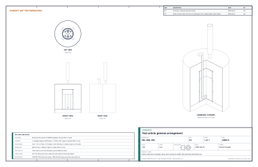

# ThermaBrick test article design precis

The test article is a one-third-scale ThermaBrick. It is a 16 US gal steel drum holding 68 kg of sand, storing 5.9 kWh(th) between 150 °C and 450 °C. The parts are estimated at $635.70. That is $35.70 over the original $600 target, and it was accepted as the test article budget on 2026-09-24 (section 5). It keeps the part of the design that carries the most risk at full fidelity: four heater cells built from the same 5/8 in cartridge heaters, 3/4 in wells and cell spacing as the full-scale unit. It cuts cost everywhere else:

- one U-tube instead of the full-scale density;
- a 120 V plug-in supply instead of a 240 V branch circuit;
- stone wool in place of AES fiber;
- a small blower and dilution stack in place of the fan and mixing tee;
- a generic controller as the independent limit.

Its purpose is to measure the numbers the full-scale design rests on before $3,674 is spent on it. Those are sand conductivity, wall contact conductance, insulation loss and the exchanger's heat transfer.

| Parameter | Value |
| --- | --- |
| Vessel | 16 US gal open-head steel drum, unlined, 20 ga (Uline S-19411) |
| Storage | 68 kg washed play sand, 491 mm deep; 5.9 kWh(th) between 150 °C and 450 °C |
| Charge | 4 cartridge heaters, 250 W at 120 V, in 3/4 in crimped wells; 1.0 kW, 8.3 A |
| Charge time from empty | 15.7 h at up to 1.0 kW, including standby loss |
| Discharge | One 1-1/4 in U-tube, 12 V blower up to 4 L/s; 250 W held for 8.8 h |
| Standby loss | 249 W at full charge |
| Envelope and mass | 880 mm diameter, 1,616 mm high including the stack; about 115 kg |
| Controls | ESP32 with five thermocouple channels; separate latching 600 °C limit |
| Parts cost | $635.70 estimated (`bom/bom-test-article.csv`); accepted budget |

*Table 1. Key parameters of the test article.*

*Figure 1. Test article general arrangement, TBK-DWG-002 Rev P1, generated from `cad/src/test_article.py`.*

## 1. Objectives

The article answers five questions. Each one feeds a specific number in TBK-CAL-001.

| No. | Question | What it settles at full scale |
| --- | --- | --- |
| O1 | What are the effective conductivity of the sand and the contact conductance at the well wall, from 150 °C to 550 °C? | Charge time and the R3 shortfall (TBK-CAL-001, section 3 and Table 8) |
| O2 | How much heat does the envelope lose, and is stone wool acceptable as the hot face? | Standby loss (R7) and a possible saving of about $330 on AES fiber |
| O3 | Does the U-tube air-side and sand-side model predict exchanger duty within 15 %? | Rated output (R4) and boost (R5) |
| O4 | Do the well-wall charge limit and the latching high limit work as intended? | Safety design (R8, R10, R12) |
| O5 | Does a thin drum grow or deform over repeated cycles? | Ratcheting risk (R19) |

*Table 2. Test objectives.*

## 2. What is kept and what is cut

| Element | Full scale | Test article | Effect on the test |
| --- | --- | --- | --- |
| Heater cell | 5/8 in heater in a 3/4 in well, cell radius 79.7 mm | Same heater and well, cell radius 84.4 mm | Full fidelity for O1 |
| Heater | 20 in, 240 V, US industrial brand | 18 in, 120 V, made-to-order import | Check each resistance on arrival |
| Well bottom | Threaded cap | Pipe end crimped closed in a vise | No threader needed |
| Exchanger | Six U-tubes, leg cell radius 81 mm | One U-tube, leg cell radius 120 mm | Tests the model, not the full-scale output (O3) |
| Air handling | Fan, servo damper, collector, mixing tee | 12 V blower on the inlet leg; dilution stack over the outlet | Flow measured directly at the inlet |
| Insulation | AES hot face and stone wool | Stone wool throughout | Tests a cost-down option (O2) |
| Supply | 240 V, 20 A, GFCI breaker | 120 V plug into a GFCI receptacle | Saves $190 |
| Limits | 1/16 DIN limit and contactor | REX-C100 and latching power relay | Same function (O4) |
| PV following | Energy meter | Not fitted; charges on a timer or from the inverter API | Deferred to firmware |

*Table 3. Differences from the full-scale design.*

## 3. Design

**Vessel and sand.** The 16 US gal drum stands on four K-23 firebricks set on edge under the chime, with stone wool packed between them. Three 50 lb bags of play sand, sieved and weighed, fill it to 491 mm. Remove the rubber lid gasket, which is rated only to 121 °C, and seal the lid with a strip of stone wool.

**Heaters and wells.** Cut a 10 ft stick of 3/4 in black pipe into four 717 mm wells, and crimp one end of each closed in a vise. The wells stand 20 mm off the drum floor at (±90, ±75) mm and end 25 mm above the lid. Each holds a 5/8 in by 18 in cartridge heater, 250 W at 120 V. The four heaters are wired in parallel through one fuse, one SSR and the contacts of the latching relay.

**Exchanger.** A U-tube made of two 1-1/4 in by 36 in black nipples, two elbows and a 6 in nipple, with its legs at y = ±103 mm. The blower is taped to the inlet leg. The outlet leg ends 40 mm inside the open bottom of a 24 in, 4 in stovepipe, which draws in room air and dilutes the exchanger air before it leaves the top. Peak outlet air is 319 °C at the lowest test demand.

**Envelope.** Two layers of stone wool in the headspace and two over the lid, three layers around the side and an aluminum flashing jacket. The jacket runs at 26 °C at full charge.

**Controls.** An ESP32 reads five MAX6675 channels:

- T1: well-wall control thermocouple, clamped at mid-depth to one well;
- T3: sand at the center, at mid-depth;
- T4: sand 20 mm from the drum wall, beside a well, at mid-depth;
- T5: exchanger outlet air;
- T6: room air.

It drives the SSR with the same rule as full scale: full power until T1 reaches 550 °C, then PI control to hold it. A separate REX-C100 reads T2, a second thermocouple on another well. Its relay output is closed below 600 °C and sits in the coil circuit of the latching power relay. An over-temperature, a press of STOP or a power interruption drops the relay, and it stays open until START is pressed. The ESP32 also drives the blower by PWM and logs every channel at 10 s intervals over Wi-Fi.

The full circuit is TBK-DWG-003 Rev P1, the controller schematic. Its KiCad source is in `electronics/test-article/`, generated by `electronics/src/schematic.py`. The latching relay K1 is double pole: pole 1 carries the heater current and pole 2 is the holding contact. R1 and R2, both 10 kΩ, hold the SSR and blower off while the ESP32 boots. The drum, wells, jacket, stack, enclosure, heater junction box and SSR heat sink are all bonded to the protective earth of the supply cord.

**Enclosure.** The controller sits in a 250 × 200 × 150 mm polycarbonate wall enclosure (IP65, UL 94 V-0 or 5VA) with a steel mounting plate bonded to PE. The layout is drawing TBK-DWG-005, generated from `cad/src/enclosure.py`.

- **DIN rail:** the HDR-15-12 supply and the K1 relay socket.
- **Top right:** the SSR on its heat sink, fins vertical.
- **Bottom left:** the controller, as modules or the optional board.
- **Under the REX-C100:** the lever-connector junctions for L_F and N.
- **Lid:** the REX-C100 and the STOP and START buttons.
- **Bottom face:** four cable glands (M25 thermocouples, M16 blower, M20 supply and M20 heater cable).

The model's fit check confirms that every part clears its neighbors by 3 mm. The REX-C100 body, 98 mm deep, ends 36 mm in front of the plate. A 100 mm deep enclosure fails the same check.

## 4. Build

The sequence follows TBK-PRC-001, section 6, and takes one weekend. It needs no pipe threader and no electrician.

1. Strip the drum's exterior paint and burn it out empty outdoors. Drill the lid for four 28.7 mm and two 44.2 mm holes from a template printed from the model.
2. Set four firebricks on edge and pack stone wool between them. Set the drum on top.
3. Stand the wells and the assembled U-tube, using the lid as a template. Clamp T1, T2 and T4 in place with steel tie wire and hang T3 on a wire guide.
4. Fill with sand in 100 mm lifts to 491 mm, rodding each lift.
5. Fit the headspace wool, the lid, the side and top wool, and the jacket. Fit the stack and the blower.
6. Drop in the heaters, land the leads in the junction box, and wire the enclosure.

> **Safety:** Respirable crystalline silica and mineral fiber. Fill and fit insulation outdoors or with local exhaust, wearing a P100 or N95 respirator, gloves and eye protection.

> **Safety:** The 4 in stack and the exchanger outlet run above 100 °C during discharge. Keep 450 mm clear of combustibles around the stack, and do not touch it while the blower is running.

> **Safety:** Plug only into a GFCI-protected receptacle rated 15 A or more, with nothing else on the circuit. Never bypass or bridge the latching relay or the REX-C100 limit.

## 5. Budget

| Group | Cost (USD) |
| --- | --- |
| Drum and sand | 134.50 |
| Heaters and wells | 100.00 |
| U-tube, blower, supply and stack | 118.00 |
| Insulation, bricks and jacket | 120.00 |
| Controls, enclosure and wiring | 163.20 |
| Total | 635.70 |

*Table 4. Test article cost by group. Line items are in `bom/bom-test-article.csv`.*

The basis is the same as the full-scale BOM: US retail and marketplace list prices in September 2026, before tax and shipping.

The estimate is $35.70 over the original $600 target. The controller enclosure model (TBK-DWG-005, section 3) showed that the $600 figure rested on three wrong entries:

- a $10 enclosure, 100 mm deep, that cannot take the REX-C100 (98 mm behind the lid);
- a barrel-jack 12 V adapter that should not be hard-wired inside a mains enclosure;
- no allowance for glands, DIN rail, lever connectors or an earth stud.

The corrected enclosure and wiring add $36.00. Three options were considered:

1. accept $635.70, with every part specified;
2. defer the $25 discharge kit until TP5 and build for $610.70 first;
3. use an enclosure or supply already on hand.

**Decided 2026-09-24: option 1.** The budget for the test article is $635.70, and the whole article, discharge kit included, is built at once.

The following tools are assumed to be on hand and are not in the budget: a multimeter, a bathroom scale, a vise, a pipe cutter, a drill with hole saws, snips and a stopwatch.

### 5.1 Optional controller board

The low-voltage controller can be built on a printed circuit board instead of hand-wired modules. The board is drawing TBK-DWG-004 Rev P1, with its KiCad source and gerbers in `electronics/controller-board/` and its parts in `bom/bom-controller-board.csv`. It measures 110 mm by 80 mm and has two layers with a ground plane.

The ESP32-DevKitC V4 and the five MAX6675 modules plug into sockets. Discrete parts replace the buck and MOSFET modules: a RECOM R-78E regulator, an IRLZ44N MOSFET with a 1N5819 flyback diode, and a 2N3904 SSR driver. The nets and GPIO pins are the same as TBK-DWG-003, so the firmware is unchanged. The mains wiring stays on the panel either way.

The board adds $24.85:

- $27.85 of board parts, including one order of five boards;
- less $6.00 for the two modules it replaces;
- plus about $3.00 for a genuine DevKitC V4 in place of a generic board, whose header spacing may not fit.

That takes the test article to $660.55. It is therefore an option, not the baseline. Its value is a repeatable, inspectable wiring job for the controller.

## 6. Test plan

Test plan TBK-TST-001 sets out seven procedures over about seven weeks, summarized in Table 5. The procedure numbers (TP) are separate from the thermocouple tags (T1 to T6).

| Procedure | Purpose | Key pass criterion |
| --- | --- | --- |
| TP0 Inspection and instrument checks | Build, sand mass, thermocouple and airflow calibration | Channels within ±2 K at 0 °C and 100 °C |
| TP1 Limit and fault response, cold | O4 | Latching trip at 600 °C ± 10 K; firmware safe state within 10 s |
| TP2 Bake-out and commissioning | Dry the sand, burn off binder, settle at 150 °C | 1 MΩ or more per heater at 500 V |
| TP3 Charge | O1 | Fitted model within 10 K RMS; time to 80 % within 10 % |
| TP4 Cool-down | O2 | Loss within 20 % of 249 W before fitting |
| TP5 Discharge | O3 | Duty within 15 % of the model, with no refit |
| TP6 Cycling | O5 | Drum growth under 0.25 % after 25 cycles |

*Table 5. Test procedures (TBK-TST-001).*

The fitted sand conductivity, contact conductance and insulation conductivity then go back into `tbk_cal_001.py`. TBK-CAL-001 will be reissued with measured values before the full-scale build is committed.

## 7. Open questions

- [ ] Confirm heater lead time and resistance tolerance from the chosen supplier; order one spare if the budget allows.
- [ ] Confirm the blower delivers 4 L/s through the U-tube (96 Pa) by the bag method in TP0.
- [x] Write firmware for charge control, logging and blower PWM (`firmware/`; wiring and API in `firmware/README.md`).
- [x] Write the formal test plan, TBK-TST-001.
- [x] Write the analysis script `docs/05-tests/tbk_tst_001_fit.py` (TBK-TST-001, section 9).
